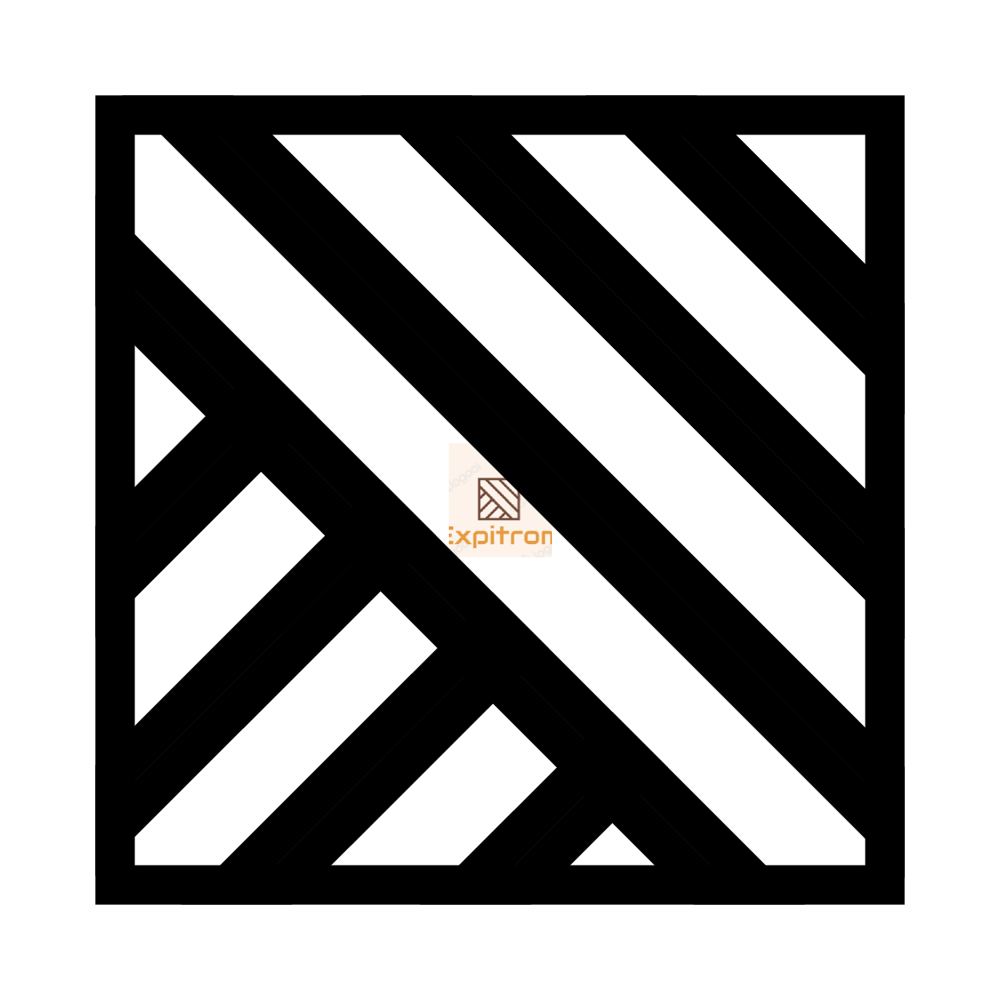

<div align="center">
	<picture>
	</picture>
	<picture>
		<source media="(prefers-color-scheme: dark)" width="30%" srcset="./assets/icon/ekko.png">
		
	</picture>
	<h1>Ekko</h1>
	<p>Cross-Platform markdown application</p>
</div>

---

## Build
```shell
flutter create .
```

