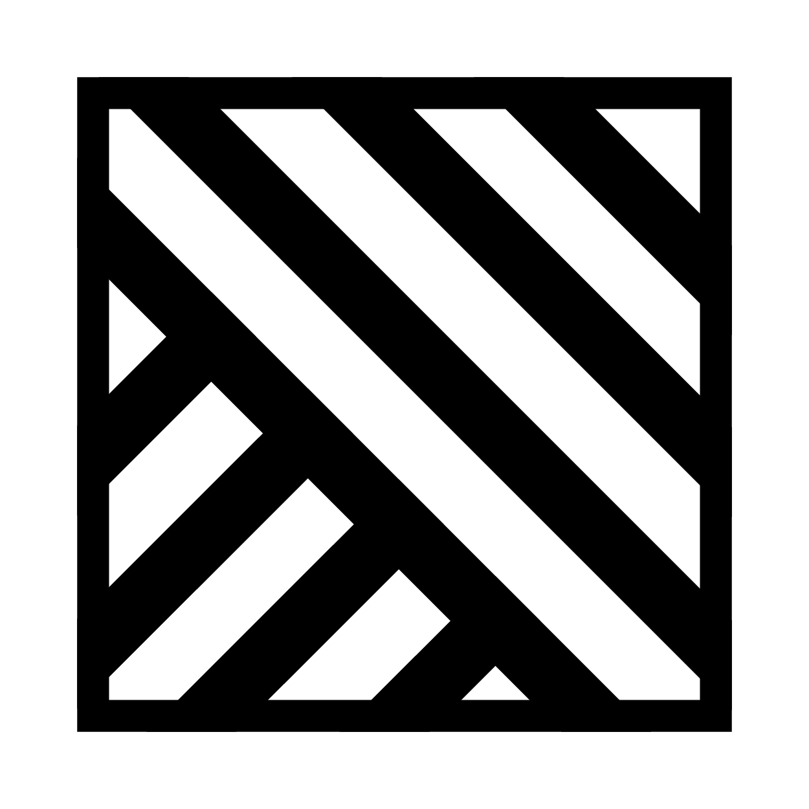

<div align="center">
	<picture>
	</picture>
	<picture>
		<source media="(prefers-color-scheme: dark)" width="30%" srcset="./assets/icon/ekko.png">
		
	</picture>
	<h1>Ekko</h1>
	<p>Cross-Platform markdown application</p>
</div>

---

## Build
```shell
# Clone the projct
git clone https://github.com/empitrix/ekko

# Move to 'ekko'
cd ./ekko

# Create a 'flutter' project
flutter create .

# Update the project
flutter pub get
```

Run the project by given `platform`:
```bash
flutter run -d <PLATFORM>
```

### Supported Platforms
- Linux
- Windows
- Android

